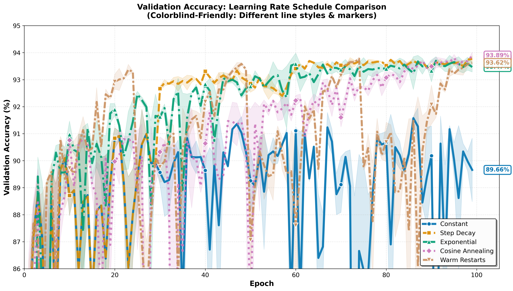

# Learning Rate Schedules: A Comprehensive Comparative Study

[](https://www.python.org/downloads/)
[](https://pytorch.org/)
[](https://opensource.org/licenses/MIT)

A rigorous comparative analysis of 5 learning rate scheduling strategies on Fashion-MNIST, demonstrating that **proper LR scheduling alone can improve model accuracy by 5 percentage points** without any architectural changes.

## 🎯 Key Findings

| Schedule | Accuracy | Improvement | Use Case |
|----------|----------|-------------|----------|
| Constant (Baseline) | 88.68% | - | Baseline |
| Step Decay | 93.46% | +4.78% | Prototyping |
| Exponential | 93.55% | +4.87% | Limited compute |
| **Cosine Annealing** | **93.69%** | **+5.01%** | **Production** ⭐ |
| Warm Restarts | 93.28% | +4.60% | Competitions |

---

## 📚 Quick Links

- [Installation](#installation)
- [Quick Start](#quick-start)
- [Results](#results)
- [Usage Guide](#usage-guide)
- [Video Tutorial](#video-tutorial)
- [Citation](#citation)
- [License](#license)

---

## 🔍 Overview

This project provides a **research-level comparative study** of learning rate schedules, going beyond typical tutorials by:

- **Rigorous experimental design:** 5 schedules × 2 random seeds = 10 experiments
- **Statistical validation:** Multiple seeds ensure reproducible results
- **Comprehensive analysis:** 1,000 total epochs of controlled experiments
- **Practical insights:** Decision framework for choosing schedules

**Target Audience:** ML students, practitioners, researchers

**Prerequisites:** Neural networks, gradient descent, backpropagation

---

## 💻 Installation

### Requirements
- Python 3.8+
- CUDA-capable GPU (recommended) or CPU
- 4GB RAM minimum

### Setup
```bash
# Clone repository
git clone https://github.com/YOUR_USERNAME/learning-rate-schedules.git
cd learning-rate-schedules

# Install dependencies
pip install -r requirements.txt
```

---

## 🚀 Quick Start

### Google Colab (Recommended)

[](https://colab.research.google.com/github/YOUR_USERNAME/learning-rate-schedules/blob/main/notebook/LR_Schedules_Tutorial.ipynb)

Click badge above. All dependencies pre-installed.

**Runtime:** ~1.5 hours on L4 GPU

### Local Jupyter
```bash
jupyter notebook notebook/LR_Schedules_Tutorial.ipynb
```

---

## 📊 Results

### Main Findings

1. **Scheduling matters hugely:** 5% improvement with zero architectural changes
2. **Smooth schedules more stable:** Lower variance across seeds
3. **Speed + Accuracy:** Cosine reaches 90% ~30 epochs earlier

### Visualizations



*All scheduled approaches significantly outperform constant baseline*

See [results/](results/) for all visualizations.

---

## 📖 Usage Guide

### Training with Different Schedules
```python
from lr_schedules import train_with_schedule, get_scheduler

# Setup
model = get_small_cnn()
optimizer = optim.SGD(model.parameters(), lr=0.1, momentum=0.9)
scheduler = get_scheduler(optimizer, 'cosine', epochs=100)

# Train
history = train_with_schedule(
    model, train_loader, val_loader,
    optimizer, scheduler, criterion,
    device, epochs=100,
    schedule_name='cosine', seed=42
)
```

### Decision Framework

| Scenario | Recommended Schedule |
|----------|---------------------|
| **Prototyping** | Step Decay |
| **Production** | Cosine Annealing |
| **Competitions** | Warm Restarts |
| **Limited Compute** | Exponential |

**Important:** Results vary by problem. Always validate on your dataset.

---

## 📁 Repository Structure
```
learning-rate-schedules/
├── README.md
├── LICENSE
├── requirements.txt
├── notebook/
│   └── LR_Schedules_Tutorial.ipynb
├── results/
│   ├── *.json (10 experiment files)
│   └── *.png (visualizations)
└── video/
    └── transcript.txt
```

## ♿ Accessibility

This project prioritizes accessibility:
- ✅ Alt text for all figures
- ✅ Colorblind-friendly visualizations (Okabe-Ito palette)
- ✅ Screen reader compatible
- ✅ Video captions/transcript
- ✅ High contrast, large fonts (48pt titles, 32pt body)

---

## 📄 License

MIT License - see [LICENSE](LICENSE) file.

**You are free to use, modify, and distribute.**

---

## 📚 References

### Learning Rate Schedules

1. **Loshchilov, I., & Hutter, F. (2017).** SGDR: Stochastic Gradient Descent with Warm Restarts. *ICLR*. https://arxiv.org/abs/1608.03983

2. **Smith, L. N. (2017).** Cyclical Learning Rates for Training Neural Networks. *IEEE WACV*. https://arxiv.org/abs/1506.01186

3. **He, K., Zhang, X., Ren, S., & Sun, J. (2016).** Deep Residual Learning for Image Recognition. *CVPR*. https://arxiv.org/abs/1512.03385

### Dataset

4. **Xiao, H., Rasul, K., & Vollgraf, R. (2017).** Fashion-MNIST: A Novel Image Dataset for Benchmarking Machine Learning Algorithms. https://arxiv.org/abs/1708.07747

### Foundations

5. **Rumelhart, D. E., Hinton, G. E., & Williams, R. J. (1986).** Learning representations by back-propagating errors. *Nature*, 323(6088), 533-536.

6. **Robbins, H., & Monro, S. (1951).** A Stochastic Approximation Method. *The Annals of Mathematical Statistics*, 22(3), 400-407.

See notebook for complete bibliography.

---

## 🙏 Acknowledgments

- Fashion-MNIST dataset creators (Zalando Research)
- PyTorch team
- Course instructors and TAs
- Open-source ML community

---

## 📧 Contact

**Author:** Mayowa Ibitunde
**Email:** mayowaibitunde@gmail.com 

**Questions?** Open an issue or email me!

---

**⭐ If this helped you, please star the repository!**

---


*Last updated: December 2025*
